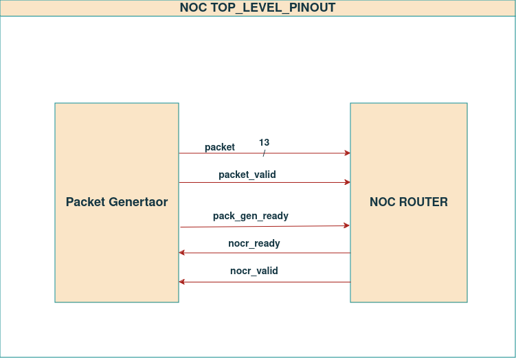
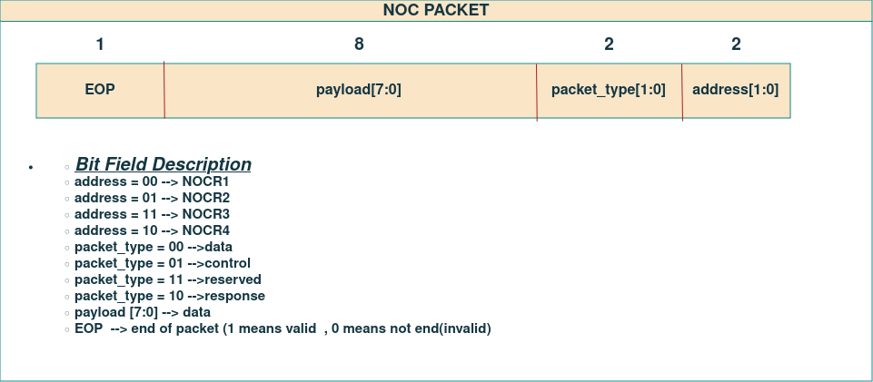
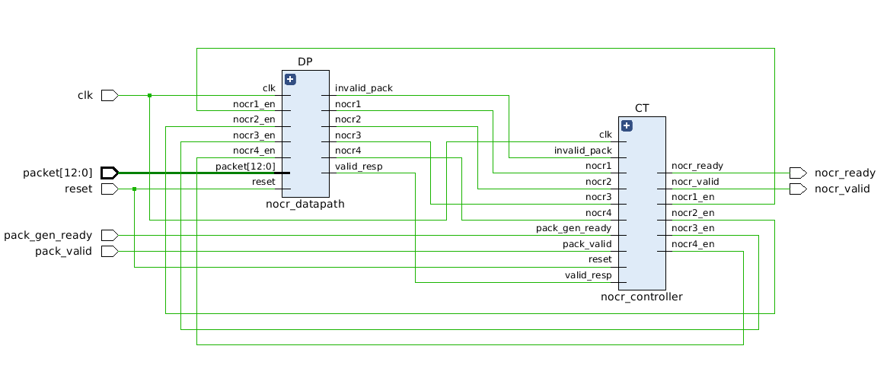

# NOC 


## Languages Used
  * System Verilog
  * C++
  * Makefile 


## Environments Used

  * Linux Ubuntu 22.04.2

# System Design Overview

  Representation of architecture through clear block diagrams is shown below.
## Top-Level Pinout Diagram


## Packet Bit Field


## Datapath and Controller Pinout



# Getting Started


## Installation of Vivado  

Install [Vivado](https://github.com/ALI11-2000/Vivado-Installation) and [Verilator](https://verilator.org/guide/latest/install.html). Follow the instructions provided in the corresponding links to build these tools.

## Build Model and Run Simulation

To build Signed Combinational Multiplier, use the provided Makefile. Follow the steps below for simulation using Verilator or Vivado.

### Simulation with Vivado
For simulation on vivado run the following command:

```markdown
make 
```

The waves on vivado will be created that can be viewed by running

```markdown
make viv_waves
``` 
### Simulation with Vsim
For simulation on vsim run the following command:

```markdown
make vsim
```

The waves on modelsim will be created that can be viewed by running

```markdown
make vsim_simulate
``` 

